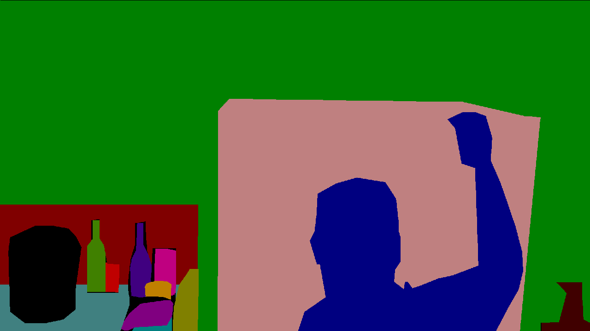
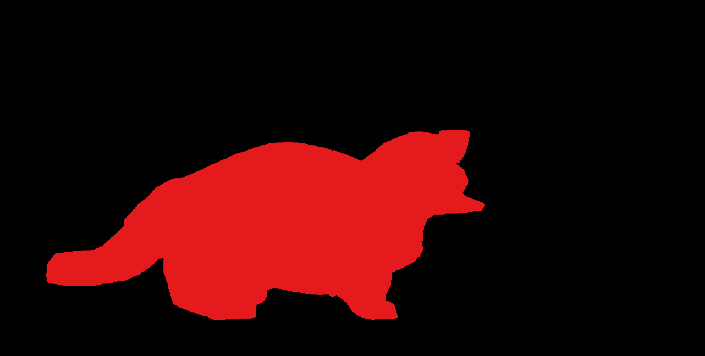

# KEVIN INSTRUCTIONS
# Add the UniVS directory to your PYTHONPATH
export PYTHONPATH=/home/ked225/binaCode/UniVS:$PYTHONPATH

# Now try running your script
sh tools/test/individual_task/test_hurricane.sh


# [UniVS: Unified and Universal Video Segmentation with Prompts as Queries (CVPR2024)](https://arxiv.org/abs/2402.18115)

[Minghan LI<sup>1,2,*</sup>](https://scholar.google.com/citations?user=LhdBgMAAAAAJ), [Shuai LI<sup>1,2,*</sup>](https://scholar.google.com/citations?hl=en&user=Bd73ldQAAAAJ), [Xindong ZHANG<sup>2</sup>](https://scholar.google.com/citations?hl=en&user=q76RnqIAAAAJ) and [Lei ZHANG<sup>1,2,$\dagger$</sup>](https://www4.comp.polyu.edu.hk/~cslzhang/)

<sup>1</sup>Hong Kong Polytechnic University, <sup>2</sup>OPPO Research Institute

[[📝 arXiv paper]](https://arxiv.org/abs/2402.18115) [[🎥 Video demo in project page]](https://sites.google.com/view/unified-video-seg-univs)

We propose a novel unified VS architecture, namely **UniVS**, by using prompts as queries. For each target of interest, UniVS averages the prompt features stored in the memory pool as its initial query, which is fed to a target-wise prompt cross-attention (ProCA) layer to integrate comprehensive prompt features. On the other hand, by taking the predicted masks of entities as their visual prompts, UniVS can convert different VS tasks into the task of prompt-guided target segmentation, eliminating the heuristic inter-frame matching. More video demo on our project page: https://sites.google.com/view/unified-video-seg-univs

<div align="center">
  
</div><br/>

## More video demo in our [project page](https://sites.google.com/view/unified-video-seg-univs)
|Task   | VIS | VSS | VPS |
|-------|-----|-----|-----|
|Output |  |  |  |

|Task | VOS | RefVOS | PVOS |
|-----|-----|--------|------|
|Prompt ||"A frog is holded by a person in his hand and place near the another frog"||
|Output |  |  | |

	
[](https://paperswithcode.com/sota/video-panoptic-segmentation-on-vipseg?p=univs-unified-and-universal-video)
[](https://paperswithcode.com/sota/video-semantic-segmentation-on-vspw?p=univs-unified-and-universal-video)
[](https://paperswithcode.com/sota/video-instance-segmentation-on-youtube-vis-2?p=univs-unified-and-universal-video)
[](https://paperswithcode.com/sota/video-object-segmentation-on-youtube-vos-1?p=univs-unified-and-universal-video)
[](https://paperswithcode.com/sota/video-object-segmentation-on-davis-2017-val?p=univs-unified-and-universal-video)
[](https://paperswithcode.com/sota/referring-expression-segmentation-on-davis?p=univs-unified-and-universal-video)
[](https://paperswithcode.com/sota/video-instance-segmentation-on-youtube-vis-1?p=univs-unified-and-universal-video)
[](https://paperswithcode.com/sota/video-instance-segmentation-on-ovis-1?p=univs-unified-and-universal-video)
[](https://paperswithcode.com/sota/referring-expression-segmentation-on-refer-1?p=univs-unified-and-universal-video)

## 📌 Updates 📌

* **🔥 `[Hightlights]`:** To facilitate the evaluation of video segmentation tasks under **the Detectron2** framework, we wrote the evaluation metrics of the six existing video segmentation tasks into the Detectron2 **Evaluators**, including VIS, VSS, VPS, VOS, PVOS, and RefVOS tasks. Now, you can evaluate VS tasks directly in our code just like COCO, and no longer need to manually adapt any evaluation indicators by yourself. Please refer to `univs/inference` and `univs/evaluation` for specific codes. If you encounter any issues when using our code, please push them to the GitHub issues. We will reply to you as soon as possible.

* **🔥 `[May-30-2024]`:** Support to test custom images for category-gudied Image Seg. tasks. Enjoy! :)

* **🔥 `[April-14-2024]`:** Support to test custom videos for text prompt-gudied VS tasks. Enjoy! :)

* **🔥 `[April-10-2024]`:** Support to test custom videos for category-gudied VS tasks. Enjoy! :)

* **🔥 `[April-8-2024]`:** Support to extract semantic feature map and object tokens for custom videos. It can be used to train segmentation-guided text-to-video generation.

* **🔥 `[Mar-20-2024]`:** Trained models with EMA on stage 3 have been released now! You can download it from [Model Zoo](Model_zoo.md).

* **🔥 `[Feb-29-2024]`:** Trained models on stage 2 have been released now! Try to use it for your video data!

* **🔥 `[Feb-28-2024]`:** Our paper has been accepted by **CVPR2024!!**. We released the paper in [ArXiv](https://arxiv.org/abs/2402.18115). 

## Table of Contents

*   [Installation](#🛠️-installation-🛠️)
*   [Datasets](#👀-datasets-👀)
*   [Unified Training and Inference](#🚀-unified-training-and-inference)
    *   [Unified Training for Images and Videos](#🌟-unified-training-for-images-and-videos)
    *   [Unified Inference for Videos](#🌟-unified-inference-for-videos)
        *   [Detailed Steps for Inference](#🌟-detailed-steps-for-inference)
    *   [Performance on 10 Benchmarks](#performance-on-10-benchmarks)
*   [Visualization Demo](#🚀-visualization-demo)
    *   [Visualization Code](#🌟-visualization-code)
    *   [Visualization Demo for Custom Videos](#🌟-visualization-demo-for-custom-videos)
        *  [Category-guided VS Tasks (VIS, VSS, VPS)](#category-guided-vs-tasks-vis-vss-vps)
        *  [Text Prompt-guided VS Task (RefVOS)](#refvos-task)

*   [Semantic Extraction for Custom Videos](#🚀-semantic-extraction-for-custom-videos)


## 🛠️ Installation 🛠️ 
See [installation instructions](INSTALL.md).

## 👀 Datasets 👀
See [Datasets preparation](./datasets/README.md).

## 🚀 Unified Training and Inference 

### 🌟 **Unified Training for Images and Videos**
We provide a script `train_net.py`, that is made to train all the configs provided in UniVS.

Download [pretrained weights of Mask2Former](https://github.com/facebookresearch/Mask2Former/blob/main/MODEL_ZOO.md) and save them into the path `pretrained/m2f_panseg/`, then run the following three stages one by one:
```
sh tools/run/univs_r50_stage1.sh
sh tools/run/univs_r50_stage2.sh
sh tools/run/univs_r50_stage3.sh
```

### 🌟 **Unified Inference for Videos**

Download trained weights from [Model Zoo](Model_zoo.md), and save it into the path `output/stage{1,2,3}/`. We support multiple ways to evaluate UniVS on VIS, VSS, VPS, VOS, PVOS and RefVOS tasks:
```
# test all six tasks using ResNet50 backbone (one-model)
$ sh tools/test/test_r50.sh

# test pvos only using ResNet50, swin-T/B/L backbones
$ sh tools/test/individual_task/test_pvos.sh
```

#### **Detailed Steps for Inference**
Step 1: You need to download the needed datasets from their original website. Please refer to [dataset preparation](https://github.com/MinghanLi/UniVS/blob/main/datasets/README.md) for more guidance.

Step 2: Built in datasets as detectron2 format in [here](https://github.com/MinghanLi/UniVS/blob/main/univs/data/datasets/builtin.py). The datasets involved in our paper has been built, so this step can be omitted. If it is a newly added dataset, it needs to be built by yourself.

Step 3: Modify the dataset name as your needed datasets in inference .sh commond. Taking the OVIS dataset of VIS task as an example, you just need to add the commond `DATASETS.TEST '("ovis_val", )' \` in the file `./tools/test/individual_task/test_vis.sh`. Then, run the commond `sh tools/test/individual_task/test_vis.sh`.

Step 4: For YouTube-VIS, OVIS, YouTube-VOS, Ref-YouTube-VOS datasets, you need to submit the predicted results (`results.json` in the output dir) to the codelab for performance evaluation. The official codelab websits are provided below for your convenience: [YouTube-VIS 2021](https://codalab.lisn.upsaclay.fr/competitions/7680#participate-submit_results), [OVIS](https://codalab.lisn.upsaclay.fr/competitions/5857#participate-submit_results), [YouTube-VOS](https://codalab.lisn.upsaclay.fr/competitions/6066#participate-submit_results), [Ref-YouTube-VOS](https://codalab.lisn.upsaclay.fr/competitions/3282#participate). For other datasets, the ground-truth annotations in valid set are released, you can get the performance directly after Step 3.

### 🌟 **Performance on 10 Benchmarks**
UniVS shows a commendable balance between perfor0mance and universality on 10 challenging VS benchmarks, covering video instance, semantic, panoptic, object, and referring segmentation tasks. 

<div align="center">
  
</div><br/>

## 🚀 **Visualization Demo**
### 🌟 **Visualization Code**
Visualization is avaliable during inference, but you need to turn it on manually. 

a) For category-guided VS tasks, you can visualize results via enabling  `self.visualize_results_enable = True` form [here](https://github.com/MinghanLi/UniVS/blob/22ccf560d682e2666c162d94b7d15786d67066e2/univs/inference/inference_video_entity.py#L168). The visualization code for VIS/VSS/VPS lies in [here](https://github.com/MinghanLi/UniVS/blob/22ccf560d682e2666c162d94b7d15786d67066e2/univs/inference/inference_video_entity.py#L1119).

b) For prompt-guided VS tasks, you need to enable `self.visualize_results_only_enable = True` [here](https://github.com/MinghanLi/UniVS/blob/22ccf560d682e2666c162d94b7d15786d67066e2/univs/inference/inference_video_vos.py#L150). The visualization code for VOS/PVOS/RefVOS [here](https://github.com/MinghanLi/UniVS/blob/22ccf560d682e2666c162d94b7d15786d67066e2/univs/inference/inference_video_vos.py#L712)

### 🌟 **Visualization Demo for Custom Videos**
Please follow the steps to run UniVS on custom videos. Until now, it only support category-guided VS tasks (VIS, VSS, VPS) and language-guided VS tasks. We will add visual prompt-guided VS tasks later.

#### Category-guided VS Tasks (VIS, VSS, VPS)
```
# Step 1: move your custom data into `./datasets/custom_videos/raw/`. Support two ways to test custom videos:
# a. any video formats with 'mp4', 'avi', 'mov', 'mkv'
# b. put all video frames in a subdir in the path `./datasets/custom_videos/raw/`
# For your convenience, we give two examples in this dir, you can directly run the below code

# Step 2:: run it
$ sh tools/test_custom_videos/test_custom_videos.sh

# Step 3: check the predicted results in the below path
$ cd datasets/custom_videos/inference
```

#### RefVOS Task
For language-guided VS task, you need to specify text prompts for each video. Therefore, only video-by-video visualization is now supported.
```
# Step 1: move your custom data into `./datasets/custom_videos/raw_text/` (only a single video). Support two ways to test custom videos:
# a. any video formats with 'mp4', 'avi', 'mov', 'mkv'
# b. put all video frames in a subdir in the path `./datasets/custom_videos/raw/`
# For your convenience, we give an example in this dir, you can directly run the below code.

# Step 2: run it
$ sh tools/test_custom_videos/test_custom_videos_text.sh
# Note: The text prompts can be changed by the parameter below, try it :)
$ vim tools/test_custom_videos/test_custom_videos_text.sh
# MODEL.UniVS.TEST.CUSTOM_VIDEOS_TEXT "[['a man is playing ice hockey', 'the goalie stick is held by a man', 'a flag on the left', 'the hockey goal cage']]" \

# Step 3: check the predicted results in the below path
$ cd datasets/custom_videos/results_text/inference
```

#### Category-guided Image Seg. Tasks (IS, SS, PS)
```
# Step 1: move your custom iamges into `./datasets/custom_images/images/`. 

# Step 2:: run it
$ sh tools/test_custom_images/test_custom_images_coco.sh

# Step 3: check the predicted results in the below path
$ cd datasets/custom_images/results/
```

## 🚀 **Semantic Extraction for Custom Videos**
There is an example to extract semantic feature map (1/32 resolution of input videos) and object tokens (200 per frame).

```
# Step 1: link your dataset into `./datasets`
$ cd datasets
$ ln -s /path/to/your/dataset  

# Step 2: Convert original videos with .mp4 format to COCO annotations
$ python datasets/data_utils/custom_videos/convert_internvid_to_coco_test.py 

# Step 3: Register the new dataset
$ vim univs/data/datasets/builtin.py
# Add the corresponding "dataset_name: (video_root, annotation_file), evaluator_type" into _PREDEFINED_SPLITS_RAW_VIDEOS_TEST
_PREDEFINED_SPLITS_RAW_VIDEOS_TEST = {
    # dataset_name: (video_root, annotation_file), evaluator_type
    "internvid-flt-1": ("internvid/raw/InternVId-FLT_1", "internvid/raw/InternVId-FLT_1.json", "none"),
}

# Step 4: extract semantic features and object tokens
$ sh tools/test_semantic_extraction/test_semantic_extraction.sh
```

## <a name="CitingUniVS"></a>🖊️ Citing UniVS 

If you use UniVS in your research or wish to refer to the baseline results published in the Model Zoo, please use the following BibTeX entry.

```BibTeX
@misc{li2024univs,
      title={UniVS: Unified and Universal Video Segmentation with Prompts as Queries}, 
      author={Minghan Li, Shuai Li, Xindong Zhang, and Lei Zhang},
      year={2024},
      eprint={2402.18115},
      archivePrefix={arXiv},
      primaryClass={cs.CV}
}
```

## 💌 Acknowledgement 

Our code is largely based on [Detectron2](https://github.com/facebookresearch/detectron2), [Mask2Former](https://github.com/facebookresearch/Mask2Former), [VITA](https://github.com/sukjunhwang/VITA), [ReferFormer](https://github.com/wjn922/ReferFormer), [SAM](https://github.com/facebookresearch/segment-anything) and [UniNEXT](https://github.com/MasterBin-IIAU/UNINEXT). We are truly grateful for their excellent work. 

## 🕹️ License

UniVS inherits all licenses of the aformentioned methods. If you want to use our code for non-academic use, please check the license first.
